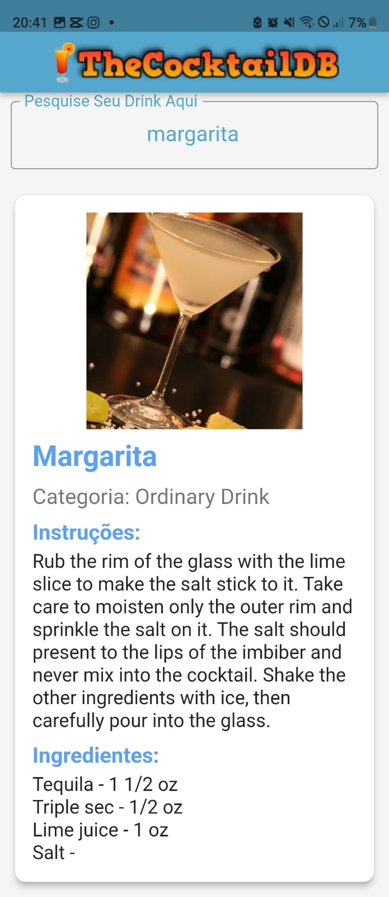
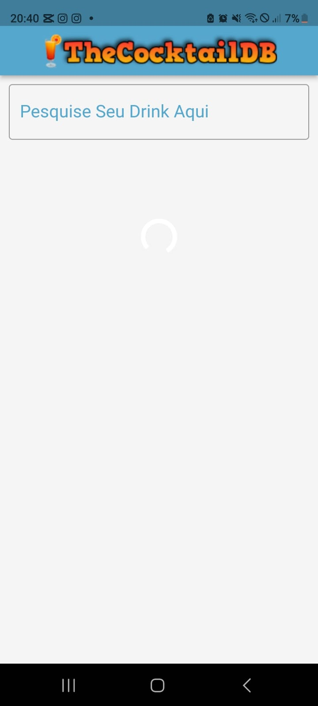

# 🍹 drinks_app

Aplicativo Flutter para explorar bebidas e coquetéis de forma simples e intuitiva, consumindo dados de uma API pública.

---

## 📱 Sobre o Projeto

O **drinks_app** é um projeto mobile desenvolvido em **Flutter**, que consome uma **API de bebidas** para exibir informações como:

- Nome e imagem da bebida  
- Ingredientes  
- Modo de preparo  
- Categoria (Alcoólico/Não alcoólico)

O app tem como objetivo **exercitar consumo de APIs REST** e boas práticas com Flutter.

---

## 🛠 Tecnologias Utilizadas

- **Flutter** (SDK >= 3.0.0)  
- **Dart**  
- **HTTP package** (para requisições)  
- **API TheCocktailDB** (ou outra API pública de bebidas)

---

## 🔍 Funcionalidades

✔️ Listagem de bebidas com imagens  
✔️ Busca por nome  
✔️ Detalhamento da bebida com ingredientes e instruções  
✔️ Consumo de API em tempo real  
✔️ Design responsivo para diferentes tamanhos de tela

---

## 📷 Imagens do App

<div style="display: flex; justify-content: space-around;">
    
    
</div>

---

## 🚀 Como Executar

Clone o repositório:

```bash
git clone https://github.com/lopesbrendinha/drinks_app.git
cd drinks_app
flutter pub get
flutter run


